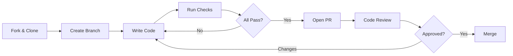
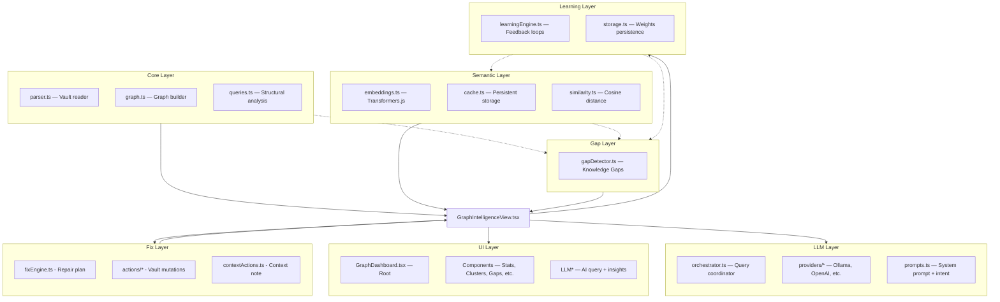
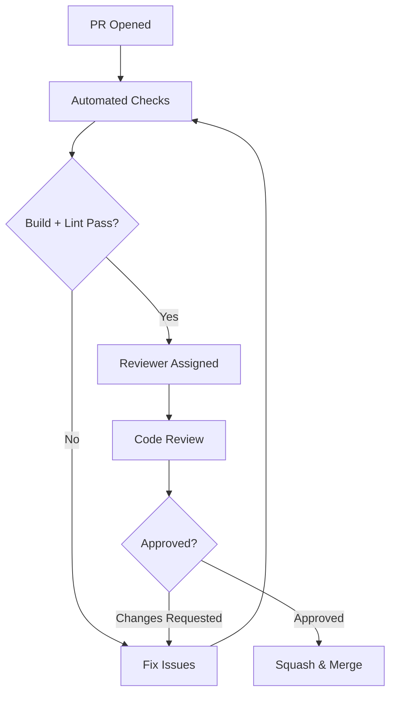
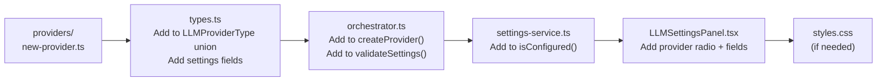

# Contributing to Graph Intelligence

Thank you for your interest in contributing to **Obsidian Graph Intelligence**! This document provides guidelines and instructions for contributing to this project.

---

## 📋 Table of Contents

- [Code of Conduct](#-code-of-conduct)
- [Getting Started](#-getting-started)
- [Development Workflow](#-development-workflow)
- [Architecture Overview](#-architecture-overview)
- [Coding Standards](#-coding-standards)
- [Commit Convention](#-commit-convention)
- [Pull Request Process](#-pull-request-process)
- [Issue Guidelines](#-issue-guidelines)
- [Adding a New LLM Provider](#-adding-a-new-llm-provider)
- [Adding a New UI Component](#-adding-a-new-ui-component)

---

## 📜 Code of Conduct

This project adheres to a Code of Conduct that all participants are expected to follow. By participating, you agree to maintain a welcoming, inclusive, and harassment-free environment.

### Our Standards

- **Be respectful** — Treat everyone with dignity, regardless of experience level
- **Be constructive** — Focus on improving the project, not criticizing people
- **Be collaborative** — Share knowledge and help others learn
- **Be patient** — Remember that everyone was a beginner once

---

## 🚀 Getting Started

### Prerequisites

| Tool | Version | Purpose |
|------|---------|---------|
| Node.js | 18+ | Runtime |
| npm | 9+ | Package management |
| TypeScript | 5.8+ | Type checking |
| Obsidian | 1.0+ | Testing environment |
| Git | 2.30+ | Version control |

### Fork & Clone

```bash
# 1. Fork the repository on GitHub

# 2. Clone your fork
git clone https://github.com/<your-username>/obsidian-graph-intelligence.git
cd obsidian-graph-intelligence

# 3. Add upstream remote
git remote add upstream https://github.com/obsidian-graph-intelligence/obsidian-graph-intelligence.git

# 4. Install dependencies
npm install
```

### Link to Obsidian for Development

```bash
# Build in watch mode
npm run dev

# In another terminal, symlink to your vault
# Windows (PowerShell - Run as Admin):
New-Item -ItemType Junction -Path "<vault>\.obsidian\plugins\graph-intelligence" -Target "<project-root>"

# macOS / Linux:
ln -s <project-root> <vault>/.obsidian/plugins/graph-intelligence
```

After linking, reload Obsidian with `Ctrl+R` / `Cmd+R` to pick up changes.

---

## 🔄 Development Workflow



### Branch Naming

| Type | Pattern | Example |
|------|---------|---------|
| Feature | `feat/<short-description>` | `feat/add-gemini-provider` |
| Bug Fix | `fix/<short-description>` | `fix/ollama-timeout` |
| Docs | `docs/<short-description>` | `docs/update-readme` |
| Refactor | `refactor/<short-description>` | `refactor/orchestrator-cache` |

### Development Commands

```bash
npm run dev      # Watch mode — rebuilds on save
npm run build    # Production build
npm run lint     # TypeScript type checking (tsc --noEmit)
```

### Pre-Submission Checklist

- [ ] `npm run build` passes with no errors
- [ ] `npm run lint` passes with no errors
- [ ] `npm run dev` watch mode works correctly
- [ ] Changes tested manually in Obsidian
- [ ] New code follows existing patterns and conventions
- [ ] Documentation updated if applicable

---

## 🏗️ Architecture Overview

Understanding the architecture is critical before contributing. The plugin is organized into isolated layers with a single Obsidian integration point coordinating data flow and vault mutations:



### Key Principles

| Principle | Description |
|-----------|-------------|
| **Props-driven UI** | All components are pure — no internal data fetching |
| **No raw vault to LLM** | LLM only sees `GraphContext` (titles, counts, summaries) |
| **Zero new dependencies for LLM** | All providers use native `fetch()` |
| **Non-blocking** | Async operations with `AbortController` cancellation |
| **Optional layers** | Plugin works without semantic engine or LLM |
| **Feedback Loop** | Actions in the UI update the `Learning` weights to refine future suggestions |
| **Idempotent vault mutations** | Link and batch-repair actions must avoid duplicate links and safely handle repeated runs |

### Fix and Action Flow

`FixMyVaultPanel` is responsible for presentation and per-item status only. It must not directly decide how the vault is repaired in bulk.

Batch repair belongs in `GraphIntelligenceView.tsx` because it owns the current graph, semantic cache, learning engine, and Obsidian app APIs. The `Apply All` flow must:

- Refresh analysis before applying a submitted plan
- Apply link repairs through `linkActions.ts`
- Apply bridge-note repairs through `noteActions.ts`
- Route unresolved orphan review items through `contextActions.ts`
- Record successful accepted actions in `LearningEngine`
- Recompute structural data and refresh semantic suggestions/gaps after mutations

Action-layer functions must return `ActionResult` and use Obsidian APIs. Do not mutate vault files from React components, and do not bypass duplicate-link detection in `linkActions.ts`.

---

## 📏 Coding Standards

### TypeScript

- **Strict mode** — All code must pass `tsc --noEmit`
- **Explicit types** — No `any` unless absolutely necessary (document why)
- **Interfaces over types** — Prefer `interface` for object shapes; use `type` for unions/aliases
- **Readonly where possible** — Use `as const` for configuration objects

### File Organization

```
// File structure template for new modules:

/**
 * Module Name — Brief description.
 *
 * Detailed explanation of responsibilities.
 */

import type { ... } from '...';  // Type imports first
import { ... } from '...';      // Value imports second

// Constants
export const MY_CONSTANT = ...;

// Types/Interfaces
export interface MyInterface { ... }

// Implementation
export class/function ...
```

### React Components

- **Functional components only** — No class components
- **Named exports** — `export function MyComponent()` not `export default`
- **Props interface** — Define in `ui/types.ts`, not inline
- **CSS class convention** — `ogi-<component>-<element>` (e.g., `ogi-llm-input-field`)

### CSS

- **All classes prefixed with `ogi-`** — Prevents conflicts with Obsidian styles
- **CSS variables for theming** — Use `var(--ogi-primary)` etc.
- **BEM-like naming** — `ogi-card`, `ogi-card-header`, `ogi-card-title--primary`
- **No CSS frameworks** — Vanilla CSS only

### Documentation

- **JSDoc comments** on all public functions, interfaces, and classes
- **Inline comments** for non-obvious logic
- **Module header** — Every file starts with a brief description comment

---

## 📝 Commit Convention

We follow [Conventional Commits](https://www.conventionalcommits.org/):

```
<type>(<scope>): <description>

[optional body]

[optional footer]
```

### Types

| Type | Description |
|------|-------------|
| `feat` | New feature |
| `fix` | Bug fix |
| `docs` | Documentation only |
| `style` | Code style (formatting, no logic change) |
| `refactor` | Code refactoring (no feature/fix) |
| `perf` | Performance improvement |
| `test` | Adding or updating tests |
| `chore` | Build process, tooling, dependencies |

### Examples

```bash
feat(llm): add Gemini provider support
fix(semantic): handle empty content snippets gracefully
docs(readme): update architecture diagram
refactor(orchestrator): extract provider caching into separate method
perf(cache): batch file reads for embedding pipeline
```

---

## 🔀 Pull Request Process

### 1. Open a Draft PR Early

Open a draft PR as soon as you start working on a feature. This helps:
- Signal your intent to prevent duplicate work
- Get early feedback on direction
- Keep track of your progress

### 2. PR Title Format

Follow the same convention as commits:

```
feat(llm): add Gemini provider with streaming support
```

### 3. PR Description Template

```markdown
## What

Brief description of the change.

## Why

Context and motivation.

## How

Technical approach and key decisions.

## Testing

- [ ] `npm run build` passes
- [ ] `npm run lint` passes
- [ ] Tested in Obsidian with sample vault
- [ ] Edge cases handled (empty vault, no internet, etc.)

## Screenshots

(If UI changes — include before/after)
```

### 4. Review Process



- All PRs require at least **one approving review**
- PRs are **squash-merged** into `main`
- Keep PRs focused — one feature/fix per PR

---

## 🐛 Issue Guidelines

### Bug Reports

Use the bug report template and include:

1. **Obsidian version** and **OS**
2. **Steps to reproduce** (numbered list)
3. **Expected behavior** vs. **actual behavior**
4. **Console errors** (if any — `Ctrl+Shift+I` in Obsidian)
5. **Vault size** (approximate number of notes)

### Feature Requests

- Check existing issues first to avoid duplicates
- Describe the **use case**, not just the solution
- Include mockups or examples if possible

---

## 🔌 Adding a New LLM Provider

This is a common contribution path. Follow these steps:

### 1. Create the Provider File

```
src/llm/providers/<provider-name>.ts
```

### 2. Implement the Interface

```typescript
import type { LLMProvider, ConnectionTestResult } from '../types';

export class MyProvider implements LLMProvider {
  constructor(apiKey: string, model: string) { ... }

  async generateText(prompt: string, signal?: AbortSignal): Promise<string> {
    // Use native fetch() — no new dependencies
    // Support AbortSignal for cancellation
    // Throw descriptive errors on failure
  }

  async testConnection(): Promise<ConnectionTestResult> {
    // Return { success: boolean, message: string }
    // Handle specific HTTP status codes (401, 429, etc.)
    // Include user-friendly error messages
  }
}
```

### 3. Update These Files



| File | Change |
|------|--------|
| `src/llm/types.ts` | Add provider to `LLMProviderType` union; add settings fields; update `DEFAULT_LLM_SETTINGS` |
| `src/llm/orchestrator.ts` | Add case to `createProvider()` and `validateSettings()` |
| `src/llm/settings-service.ts` | Add case to `isConfigured()` |
| `src/ui/LLMSettingsPanel.tsx` | Add radio option + conditional form fields |

### 4. Rules

- **Do NOT** add npm dependencies — use `fetch()`
- **Do NOT** log API keys — ever
- **Do** support `AbortSignal` in `generateText()`
- **Do** return user-friendly messages in `testConnection()`
- **Do** handle timeout, auth errors, and rate limits explicitly

---

## 🎨 Adding a New UI Component

### 1. Create the Component

```
src/ui/MyComponent.tsx
```

### 2. Define Props

Add the props interface to `src/ui/types.ts`:

```typescript
export interface MyComponentProps {
  data: SomeData;
  onAction: (id: string) => void;
}
```

### 3. Follow Patterns

- Use existing components as reference (e.g., `SuggestionsPanel.tsx`)
- CSS classes: `ogi-mycomponent`, `ogi-mycomponent-item`
- Add styles to `styles.css` under a clear section header
- Export from `src/ui/index.ts`

---

## 💬 Questions?

- Open a [Discussion](https://github.com/obsidian-graph-intelligence/discussions) for general questions
- Open an [Issue](https://github.com/obsidian-graph-intelligence/issues) for bugs or feature requests
- Tag `@maintainers` if you need architectural guidance

---

<div align="center">

**Thank you for helping improve Graph Intelligence!** 🎉

</div>
