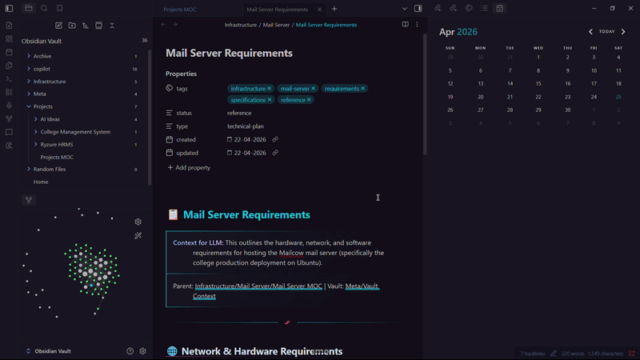
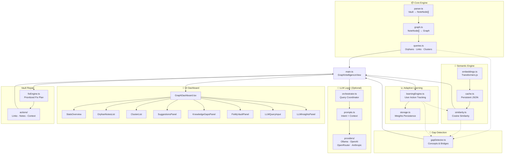
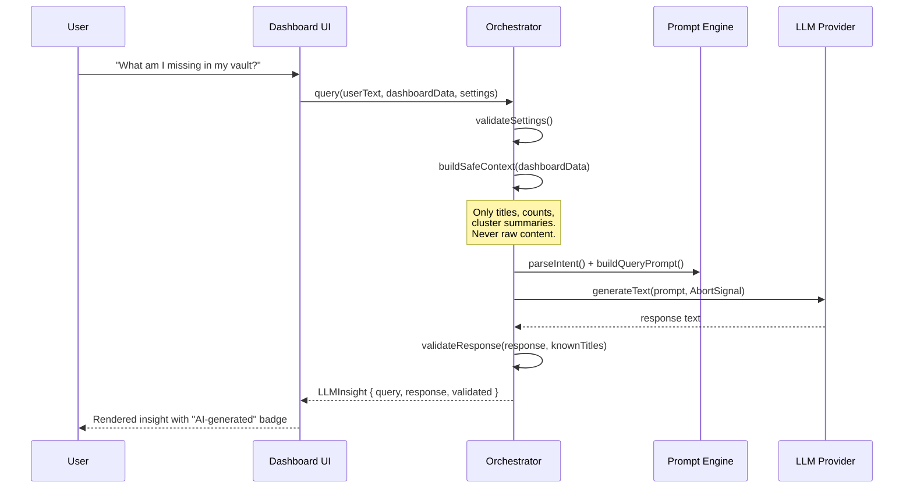
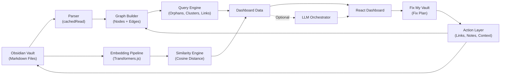

<div align="center">

# 🧠 Obsidian Graph Intelligence

**AI-powered graph analysis, semantic similarity, and intelligent link suggestions for your Obsidian vault.**

[](https://github.com/obsidian-graph-intelligence)
[](https://obsidian.md)
[](https://www.typescriptlang.org/)
[](https://react.dev/)
[](./LICENSE.md)

<br/>

*Turn your vault into an intelligent, self-improving knowledge graph.*

</div>

---

## 🎥 Demo

[](./assets/demo.mp4)

---

## ✨ Features

| Feature | Description |
|---------|-------------|
| **Fix My Vault** | Builds an actionable repair plan from gaps, semantic suggestions, and orphan notes |
| **Apply All** | Applies every automatable repair, reconnects unresolved orphans through a maintained context note, and refreshes graph analysis |
| 📊 **Structural Analysis** | Parses every note in your vault and builds a directed graph from wikilinks |
| 🏝️ **Orphan Detection** | Finds isolated notes with no incoming or outgoing connections |
| 🔗 **Cluster Discovery** | Identifies connected components via BFS to reveal topic groupings |
| 🧬 **Semantic Similarity** | Local embeddings via Transformers.js — finds notes that *should* be linked |
| 🧠 **Knowledge Gaps** | Discovers missing conceptual bridges, orphan matches, and weakly-linked clusters |
| 🤖 **AI Reasoning** | Optional LLM layer for natural language questions about your vault |
| 📈 **Adaptive Learning**| System learns from your actions (accept/ignore) to improve future ranking and confidence |
| 🔒 **Privacy-First** | Semantic analysis runs entirely locally. LLM only sees structured summaries — never raw content |

---

## 🏗️ Architecture



---

## 📂 Project Structure

```
obsidian-graph-intelligence/
├── manifest.json                # Obsidian plugin manifest
├── styles.css                   # All styles (scoped under .ogi-root)
├── esbuild.config.mjs           # Build configuration
├── package.json
├── tsconfig.json
│
├── src/
│   ├── main.ts                  # Plugin entry — registers view + commands
│   │
│   ├── core/                    # Graph analysis engine
│   │   ├── types.ts             # NoteNode, Edge, Graph
│   │   ├── parser.ts            # Vault → NoteNode[] (wikilinks, tags, snippets)
│   │   ├── graph.ts             # NoteNode[] → directed Graph
│   │   ├── queries.ts           # Orphans, links, clusters (BFS)
│   │   └── index.ts             # Barrel exports
│   │
│   ├── semantic/                # Local embedding pipeline
│   │   ├── embeddings.ts        # Transformers.js (Xenova/all-MiniLM-L6-v2)
│   │   ├── cache.ts             # Persistent JSON cache
│   │   └── similarity.ts        # Cosine similarity + link suggestions
│   │
│   ├── gap/                     # Knowledge Gap Detection
│   │   ├── gapTypes.ts          # Gap definitions and thresholds
│   │   └── gapDetector.ts       # Structural + semantic gap logic
│   │
│   ├── llm/                     # Optional LLM reasoning layer
│   │   ├── types.ts             # LLMSettings, Provider interface, GraphContext
│   │   ├── orchestrator.ts      # Query lifecycle, AbortController, caching
│   │   ├── prompts.ts           # System prompt, intent parsing, context serialization
│   │   ├── settings-service.ts  # Isolated persistence (Obsidian saveData)
│   │   ├── providers/
│   │   │   ├── ollama.ts        # Local Ollama (default)
│   │   │   ├── openai.ts        # OpenAI Chat Completions
│   │   │   ├── openrouter.ts    # OpenRouter (OpenAI-compatible)
│   │   │   └── anthropic.ts     # Anthropic Messages API
│   │   └── index.ts
│   │
│   ├── plugin/                  # Obsidian integration
│   │   ├── GraphIntelligenceView.tsx  # ItemView + React mount + pipelines
│   │   └── index.ts
│   │
│   ├── learning/                # Adaptive Learning System
│   │   ├── learningTypes.ts     # Action and weight types
│   │   ├── storage.ts           # JSON persistence (learning.json)
│   │   └── learningEngine.ts    # Scoring adjustments & feedback loop
│   │
│   └── ui/                      # React components (props-driven)
│       ├── types.ts             # DashboardData contract + component props
│       ├── GraphDashboard.tsx   # Root layout
│       ├── StatsOverview.tsx    # Stats cards
│       ├── SearchBar.tsx        # Local filtering
│       ├── ClusterList.tsx      # Connected components
│       ├── OrphanNotesList.tsx  # Orphan notes
│       ├── SuggestionsPanel.tsx # Semantic suggestions
│       ├── KnowledgeGapsPanel.tsx # Gap visualizations
│       ├── LLMQueryInput.tsx    # AI query input (separate from search)
│       ├── LLMInsightsPanel.tsx # AI response display with collapsible dropdown
│       ├── LLMSettingsPanel.tsx # Provider configuration
│       ├── ErrorBoundary.tsx    # React error boundary
│       └── index.ts
│
└── main.js                      # Built bundle (generated)
```

---

## 🚀 Getting Started

### Prerequisites

- [Node.js](https://nodejs.org/) 18+
- [Obsidian](https://obsidian.md/) 1.0+
- (Optional) [Ollama](https://ollama.ai/) for local AI reasoning

### Installation

```bash
# Clone the repository
git clone https://github.com/obsidian-graph-intelligence.git
cd obsidian-graph-intelligence

# Install dependencies
npm install

# Development (watch mode)
npm run dev

# Production build
npm run build

# Type check
npm run lint
```

### Install in Obsidian

1. Run `npm run build`
2. Copy these files into `<vault>/.obsidian/plugins/graph-intelligence/`:
   - `main.js`
   - `manifest.json`
   - `styles.css`
3. Enable the plugin in **Settings → Community Plugins**
4. Click the 🧠 icon in the ribbon, or use the command palette: **"Open Graph Intelligence Dashboard"**

---

## 🤖 AI Reasoning (Optional)

The LLM layer is **completely optional**. The plugin works fully without it — structural analysis and semantic similarity run locally by default.

### How It Works



### Supported Providers

| Provider | Type | Auth | Default Model |
|----------|------|------|---------------|
| **Ollama** | Local | None | `llama3.2` |
| **OpenAI** | Cloud | API Key | `gpt-4o-mini` |
| **OpenRouter** | Cloud | API Key | `llama-3.1-8b-instruct:free` |
| **Anthropic** | Cloud | API Key | `claude-3-sonnet` |

All model names are **user-configurable** — nothing is hardcoded.

### Safety Guarantees

| Principle | Implementation |
|-----------|---------------|
| 🔒 **No raw content** | LLM only receives `GraphContext` — titles, counts, cluster summaries |
| 🎯 **Intent classification** | Keyword-based, deterministic — no LLM needed for routing |
| ✅ **Output validation** | Quoted note references checked against known vault titles |
| 🚫 **Hallucination guard** | System prompt explicitly forbids fabricating note titles |
| ⚡ **Non-blocking** | All LLM calls are async with `AbortController` cancellation |
| 📏 **Context limits** | Hard caps: 20 orphan titles, 5 clusters, 5 titles/cluster, 10 similar pairs |

---

## 🧬 Semantic Engine

The semantic pipeline runs **entirely locally** using [Transformers.js](https://huggingface.co/docs/transformers.js):

- **Model**: `Xenova/all-MiniLM-L6-v2` (loaded lazily on first use)
- **Context Size**: Processes up to **2,000 characters** per note for high-fidelity semantic matching
- **Cache**: Embeddings persisted in a JSON file inside the plugin directory
- **Adaptive**: Learns from every link you accept or suggestion you dismiss to refine the "Match" percentages
- **Background processing**: Batch processing in groups of 5 with UI thread yielding
- **Orphan priority**: Orphan notes are processed first for faster insight generation

---

## Fix My Vault and Apply All

`FixMyVaultPanel` turns structural, semantic, and gap-detection output into a repair plan using `src/fix/fixEngine.ts`.

`Apply All` is a plugin-level batch operation, not a UI-only loop. It:

- Re-runs analysis before applying changes so the plan starts from current vault state
- Applies link fixes through `src/actions/linkActions.ts`
- Creates bridge notes for concept gaps through `src/actions/noteActions.ts`
- Reconnects unresolved orphan notes through `Graph Intelligence Context.md`
- Records accepted actions in the learning engine
- Refreshes structural graph data, semantic suggestions, knowledge gaps, orphan counts, clusters, and UI state after the batch

Links created by Graph Intelligence are bidirectional and idempotent. Existing links are detected before mutation, so repeated runs should not create duplicate links.

Relevant modules:

- `src/fix/fixEngine.ts` builds the prioritized plan
- `src/fix/fixTypes.ts` defines fix item and batch result contracts
- `src/actions/linkActions.ts` creates bidirectional wikilinks
- `src/actions/noteActions.ts` creates notes and bridge notes
- `src/actions/contextActions.ts` maintains `Graph Intelligence Context.md`
- `src/plugin/GraphIntelligenceView.tsx` coordinates Apply All, learning updates, and graph refreshes

---

## 📊 Data Flow



---

## 🛠️ Tech Stack

| Technology | Purpose |
|-----------|---------|
| **TypeScript 5.8** | Type-safe development |
| **React 19** | Component-based UI |
| **esbuild** | Fast bundling with watch mode |
| **Transformers.js** | Local ML embeddings |
| **Lucide React** | Icon system |
| **Obsidian API** | Plugin integration |

**Zero runtime dependencies for LLM** — all providers use native `fetch()`.

---

## 🤝 Contributing

We welcome contributions! Please read our [Contributing Guide](./CONTRIBUTING.md) for details on the development process, coding standards, and how to submit pull requests.

## 🔒 Security

For security concerns and responsible disclosure, please see our [Security Policy](./SECURITY.md).

## 📄 License

This project is licensed under the MIT License — see the [LICENSE](./LICENSE.md) file for details.

---

<div align="center">

**Built with ❤️ for the Obsidian community**

[Report Bug](https://github.com/obsidian-graph-intelligence/issues) · [Request Feature](https://github.com/obsidian-graph-intelligence/issues) · [Discussions](https://github.com/obsidian-graph-intelligence/discussions)

</div>
