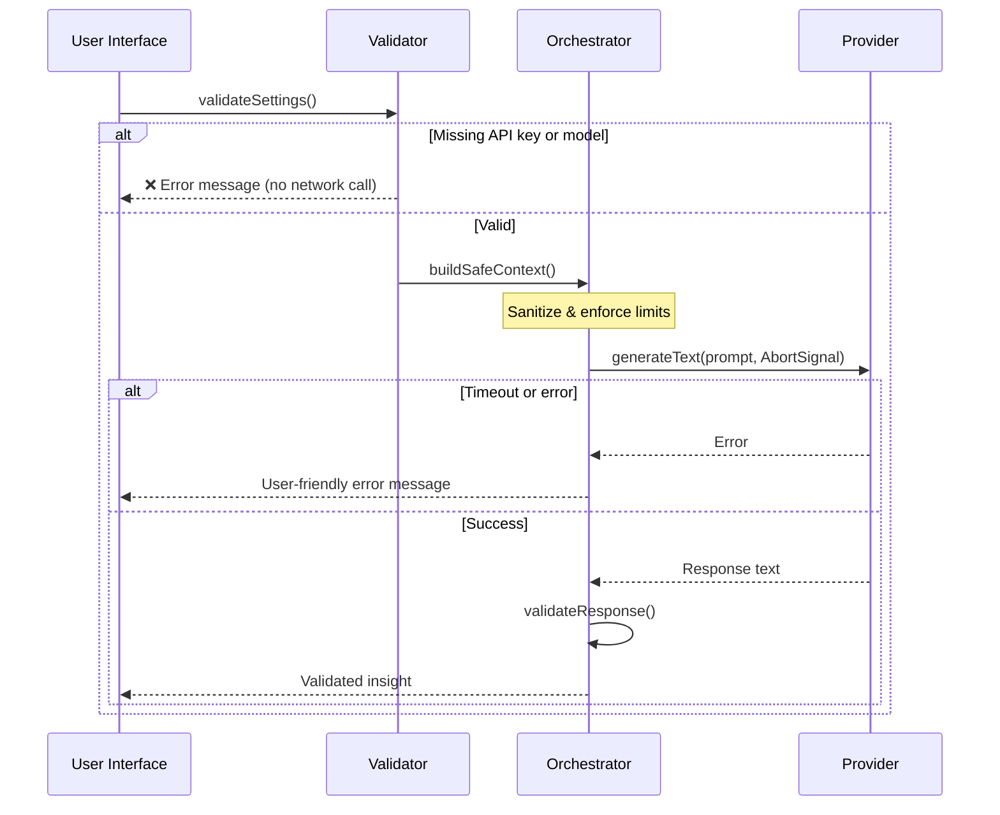

# Security Policy

## Supported Versions

| Version | Supported |
|---------|-----------|
| 0.1.x   | ✅ Active |

---

## 🔒 Security Architecture

Graph Intelligence is designed with a **privacy-first, defense-in-depth** approach. This document outlines the security model, data handling guarantees, and how to report vulnerabilities.

### Data Flow & Trust Boundaries

```mermaid
graph TD
    subgraph Trust_Local["🟢 Trusted Zone (Local)"]
        Vault["Obsidian Vault<br/>(User's Notes)"]
        Parser["Parser<br/>(Read-only)"]
        Graph["Graph Engine"]
        Embeddings["Embedding Pipeline<br/>(Transformers.js)"]
        Cache["Embedding Cache<br/>(Local JSON)"]
        Settings["LLM Settings<br/>(Obsidian saveData)"]
    end

    subgraph Trust_Boundary["🟡 Trust Boundary"]
        Orchestrator["LLM Orchestrator"]
        SafeContext["Safe Context Builder<br/>(Sanitization Layer)"]
    end

    subgraph Trust_External["🔴 External (Optional)"]
        LLM["LLM Provider<br/>(Cloud API)"]
    end

    Vault -->|"Read-only access"| Parser
    Parser --> Graph --> Orchestrator
    Embeddings --> Cache
    Orchestrator --> SafeContext
    SafeContext -->|"Only: titles, counts,<br/>cluster summaries"| LLM
    Settings -->|"API keys (encrypted at rest<br/>by Obsidian)"| Orchestrator

    style Trust_Local fill:#1a3a1a,stroke:#4ade80
    style Trust_Boundary fill:#3a3a1a,stroke:#facc15
    style Trust_External fill:#3a1a1a,stroke:#f87171
```



---

## 🛡️ Security Guarantees

### What We Protect

| Asset | Protection |
|-------|-----------|
| **Note content** | Never sent to any external service. LLM only receives structured summaries. |
| **File paths** | Stripped by the safe context builder. LLM sees titles only. |
| **Embeddings** | Computed locally via Transformers.js. Never transmitted. |
| **Tags & metadata** | Not included in LLM context. |
| **API keys** | Stored via Obsidian's `saveData()` (encrypted at rest). Never logged. |

### What the LLM Receives

The LLM context (`GraphContext`) contains **only**:

```typescript
{
  totalNotes: number;       // e.g., 142
  totalLinks: number;       // e.g., 387
  orphanCount: number;      // e.g., 12
  clusterCount: number;     // e.g., 5
  orphanTitles: string[];   // max 20 titles
  clusterSummaries: [{      // max 5 clusters
    noteCount: number;
    sampleTitles: string[]; // max 5 per cluster
  }];
  similarPairs: [{          // max 10 pairs
    noteA: string;          // title only
    noteB: string;          // title only
  }];
}
```

### Hard Limits

| Field | Maximum | Purpose |
|-------|---------|---------|
| Orphan titles | 20 | Prevents large vault leakage |
| Clusters | 5 | Keeps prompt size deterministic |
| Titles per cluster | 5 | Caps per-cluster exposure |
| Similar pairs | 10 | Limits suggestion context |

---

## 🔐 API Key Handling

### Storage

- API keys are persisted via Obsidian's `Plugin.saveData()` method
- Obsidian stores plugin data in `<vault>/.obsidian/plugins/graph-intelligence/data.json`
- Keys are **never logged** to console, file, or analytics
- Settings UI uses `<input type="password">` with `autocomplete="off"`

### Transmission

- API keys are sent **only** to the configured provider's official endpoint
- Keys are transmitted via secure headers (`Authorization: Bearer` or `x-api-key`)
- All cloud providers use **HTTPS** exclusively
- No telemetry, analytics, or third-party services receive any user data

### What We Do NOT Do

- ❌ Log API keys (even in debug mode)
- ❌ Send keys to any service other than the configured provider
- ❌ Store keys in plain text outside of Obsidian's data store
- ❌ Include keys in error messages or stack traces
- ❌ Transmit vault content to external services

---

## 🧪 LLM Security Hardening

### System Prompt Constraints

The LLM system prompt explicitly instructs the model to:

1. **Only reference notes that exist** in the provided context
2. **Refuse to answer** questions unrelated to the vault's knowledge graph
3. **Never fabricate** note titles, file paths, or statistics
4. **Produce structured output** (bullet points) to reduce hallucination surface

### Output Validation

After every LLM response, the orchestrator:

1. Extracts all quoted strings from the response
2. Cross-references them against known vault titles
3. Appends a `⚠️` warning if unverified references are found

### Request Lifecycle



---

## 🌐 Network Security

### Endpoints Contacted

The plugin only contacts endpoints **explicitly configured** by the user:

| Provider | Endpoint | Purpose |
|----------|----------|---------|
| Ollama | `http://localhost:11434` (configurable) | Local inference |
| OpenAI | `https://api.openai.com/v1/*` | Cloud inference |
| OpenRouter | `https://openrouter.ai/api/v1/*` | Cloud inference |
| Anthropic | `https://api.anthropic.com/v1/*` | Cloud inference |

- **No other network requests** are made by the plugin
- The semantic engine (Transformers.js) downloads the model on first use via Hugging Face CDN, then caches it locally

### AbortController

All outbound requests support cancellation via `AbortController`:
- New queries cancel previous in-flight requests
- View close (`onClose`) cancels any active request
- Prevents resource leaks and stale responses

---

## 📢 Reporting a Vulnerability

### Responsible Disclosure

If you discover a security vulnerability, **please do not open a public issue**. Instead:

1. **Email**: Send a detailed report to the maintainer
2. **Include**:
   - Description of the vulnerability
   - Steps to reproduce
   - Potential impact
   - Suggested fix (if any)
3. **Response time**: We aim to acknowledge reports within **48 hours**
4. **Fix timeline**: Critical vulnerabilities will be patched within **7 days**

### Scope

The following are **in scope** for security reports:

| In Scope | Out of Scope |
|----------|-------------|
| Data leakage (raw content sent to LLM) | Vulnerabilities in Obsidian itself |
| API key exposure (logging, transmission) | Issues with third-party LLM providers |
| XSS via LLM response rendering | Theoretical attacks requiring physical access |
| Path traversal in file operations | Denial of service against local Ollama |
| Unsafe `dangerouslySetInnerHTML` usage | Social engineering attacks |

### Bug Bounty

We do not currently operate a formal bug bounty program, but we deeply appreciate responsible disclosure and will publicly credit reporters (with permission) in our release notes.

---

## 🔄 Security Updates

Security patches are released as **patch versions** (e.g., `0.1.1`) and announced via:

- GitHub Releases
- The `CHANGELOG.md` file
- GitHub Security Advisories (for critical issues)

---

<div align="center">

**Security is a shared responsibility. Thank you for helping keep Graph Intelligence safe.** 🛡️

</div>
